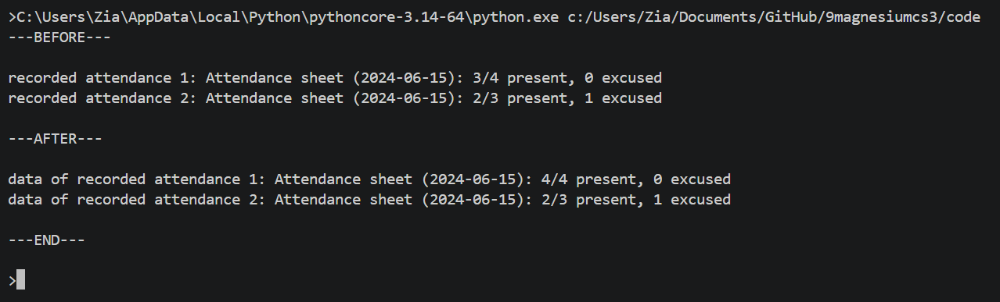
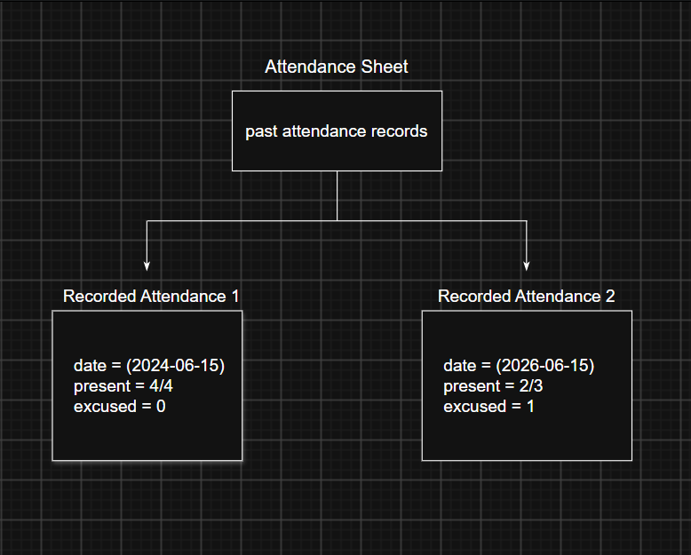

# Class Attributes and Methods
## Previous Design
Link to my previous activity:
[classObjectUML.md](classObjectUML.md)
## Design Revision
Describe any changes made to your original class.
## Visibility Decisions
| Attribute | Data Type | Visibility | Reason |
|---|---|---|---|
| | | | |
| | | | |
| | | | |
| | | | |
## Updated UML Class Diagram

## Test Run

## Object Diagram

## Analysis
### Why did you make your chosen attribute private?
### Which method changes the state of your object?
### How did your two objects demonstrate that instances are independent?
### What is the difference between your class diagram and your object diagram?
